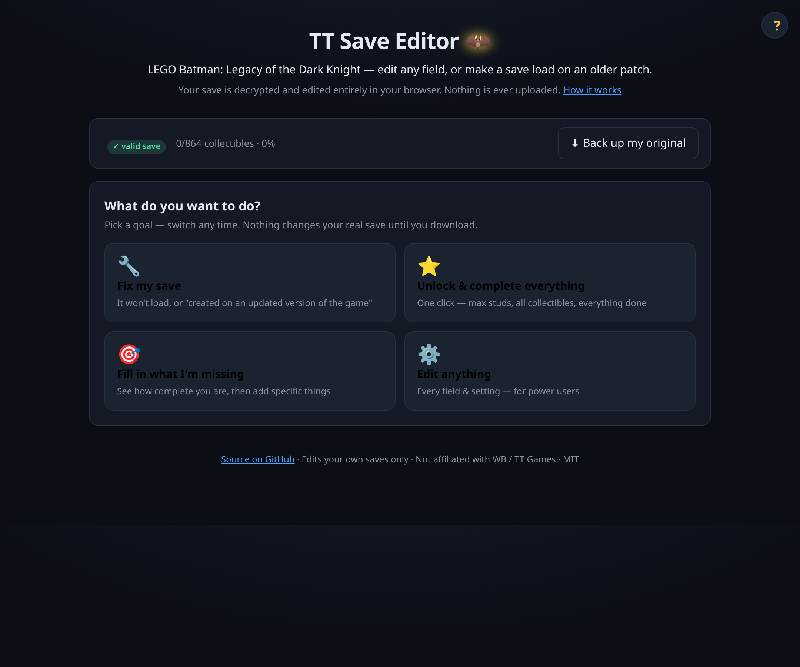
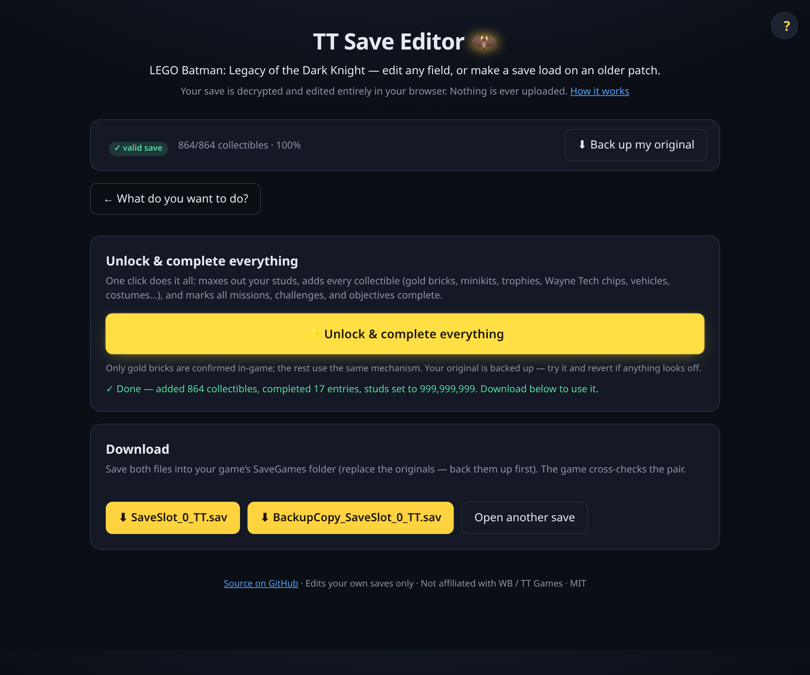
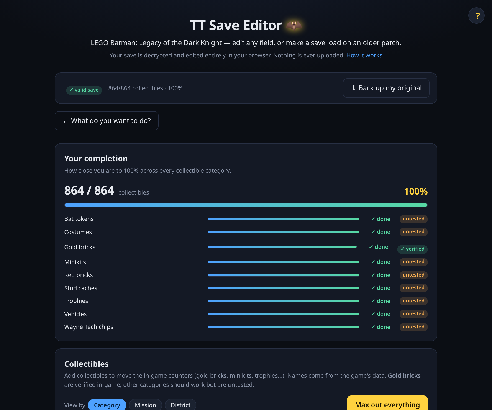
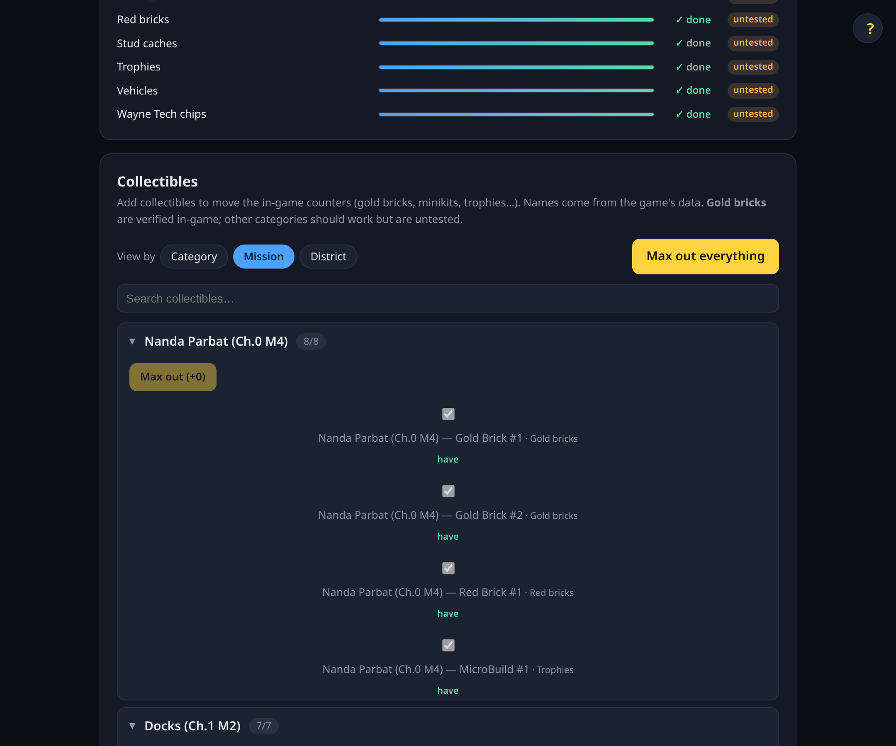

# TT Save Editor

A save editor for LEGO Batman: Legacy of the Dark Knight that runs in your browser. Drop in a `.sav`, edit what you want, download it. Decrypt, edit, and re-encrypt all happen on your machine.

Live: https://tt-save-editor.vercel.app · Current release: **v0.2.0**



## What it can do

Drop in `SaveSlot_0_TT.sav`, the editor decrypts it, and instead of a wall of panels you pick a goal:

- **🔧 Fix my save** — the original reason this exists. If the game refuses your save with *"This save was created on an updated version of the game"* after an update, this rolls the build-version stamp back so an older build will load it (type the number, or read it from a save made on the older build). Plain-language help for where saves live (Steam / Epic / Proton) and the `SaveSlot_…` + `BackupCopy_…` file pair.
- **⭐ Unlock & complete everything** — one click: max studs, add every collectible, and complete the progress in your save. 
- **🎯 Fill in what I'm missing** — a completion overview (how complete you are, per category), then add specific collectibles or missions. 
- **⚙️ Edit anything** — the full power-user surface: a Studs box, a Playtime box (minutes, writes the `TotalPlaytime` Timespan), every enum setting by gameplay tag, and an Advanced section exposing every value in the save by name.

A status bar across the top always shows **✓ your save is valid** (it passed a byte-exact round-trip check on load), your collectible completion %, and a one-click **back up my original**.

**Collectibles** — pick what to add by **Category** (gold bricks, minikits, trophies, Wayne Tech chips, vehicles, costumes…), by **Mission**, or by **District**, or "max out" a whole category, and the in-game counters actually move. Each entry shows its real in-game name (e.g. *Iceberg Lounge (Ch.1 M5) — Gold Brick #1*), extracted from the game's own data files.



**Missions & objectives** — every mission and objective in the game (not just the ones in your save), objectives nested under their mission. Ones you have are editable; ones you haven't reached can be added.

> Gold bricks are confirmed to move their counter in-game; the other collectible categories use the identical mechanism and are marked **untested**. Adding missions/objectives you haven't reached is advanced and can affect story progression — your original is always backed up.

The download gives you both `SaveSlot_X_TT.sav` and its matching `BackupCopy_SaveSlot_X_TT.sav`. The game checks the pair, so the tool writes both.

## What's solid and what isn't

**Solid since v0.1.2:** the save-corruption bug from v0.1.1 (BlackcatXII's report). Changing an enum value to a member of different byte length used to silently shift the rest of that section, which made the game misread it and reset neighbouring state — that's gone. The recursive GVAS walker now updates every parent container's `Size` field when the body changes length.

**Shipped in v0.1.4:** in-game collectible counters (gold bricks, trophies, minikits, costumes, vehicles, Wayne Tech, etc.) **are derived at runtime from how many enum entries exist in your save, not what state they're in**. Flipping a `Locked` gold brick to `Collected` updates the file but doesn't move the displayed `N/30` — you have to add a *new* entry. The editor now does exactly that (the Collectibles panel), building each new entry as a byte-perfect clone of a real one and bumping the array count + every ancestor container `Size` (the v0.1.2 mechanism). Verified in-game: inserting a gold brick took the counter from 3/30 to 4/30 on the pre-patch build. Valid tags and their display names are extracted from the game's UE5 paks into a bundled manifest, validated so each category's tag count matches the in-game `/N`. Gold bricks are the verified category; the rest share the identical mechanism and are marked untested in the UI.

State changes might still affect non-counter things (mission replay, in-world visuals, achievement triggers). We haven't fully mapped which.

## Credit

The save cipher (RC4 with a 32-byte key compiled into the game executable) was pulled out of the binary by [@RealDarkCraft](https://github.com/RealDarkCraft/LEGO-Batman-Legacy-of-the-Dark-Knight---Save-decryptor). The editor is built on top of that.

## Safety

This thing edits your save, so the obvious failure mode is corrupting it. The design takes that seriously.

The body of the save is preserved byte for byte. Only the bytes you change get touched. Load a save, do nothing, download it, and you get the same file back. That's verified in the test suite against real saves up to a 1.5 MB 100% completion file. On load the editor also runs a round-trip self-check, and if it can't reproduce the input exactly, it refuses to hand you anything. Originals are never written in place either; the result is always a download.

Even so, keep a copy of your original before replacing it. Software is software.

## How it works

Saves are RC4-encrypted with a fixed 32-byte key baked into the game. The same key works for every copy, which is what makes this fully client-side. Under the encryption is standard UE5 GVAS (engine branch `++Dinner+mainline`). The editor parses the header, locates editable scalar and enum fields by name (never by fixed offset, since offsets shift between saves), and rewrites only the bytes you change.

For currency / wallet fields like Studs, the game stores the value in multiple denormalized places (`StudsCollected` plus two `Saved_Total` fields). Updating one and not the others = the game ignores your edit. The editor writes them in sync.

## Repo

```
packages/core    @tt-save/core — decrypt / parse / scan / edit / re-encrypt. No UI, no network.
apps/web         React + Vite SPA (the editor itself).
docs/            design specs and the v0.1.2 research brief.
```

## Develop

```bash
pnpm install
pnpm -C packages/core test     # the safety net. Run this.
pnpm -C apps/web dev           # http://localhost:5173
```

## Contributing

The Studs box and the friendly enum titles live in data files: `packages/core/src/featured.ts` and `packages/core/src/enums.ts`. To map a new field: change it in-game, re-save, diff, add an entry. PRs welcome.

The original v0.1.2 research brief that drove the structural-parser work is at [`docs/v0.1.2-research-brief.md`](docs/v0.1.2-research-brief.md) — kept for posterity.

## Legal

Edits your own save files for your own copy of the game (interoperability, personal use). Not affiliated with, endorsed by, or connected to Warner Bros. or TT Games. MIT licensed.

---

*Keywords: LEGO Batman Legacy of the Dark Knight save editor, save downgrade, version downgrade, "created on an updated version" fix, GVAS editor, TtSave, speedrun practice.*
